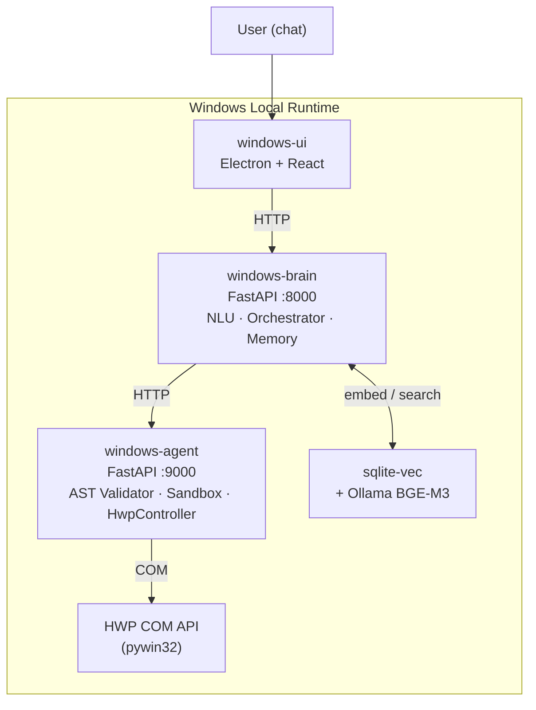

<div align="center">


<h3><b>HiHangul</b></h3>
<p><b>Local-first AI assistant for HWP document automation on Windows.</b></p>

<p>
  <a href="#features"><strong>Features</strong></a> ·
  <a href="#tech-stack"><strong>Tech Stack</strong></a> ·
  <a href="#getting-started"><strong>Getting Started</strong></a> ·
  <a href="#architecture"><strong>Architecture</strong></a>
</p>

<p>

[](https://python.org)
[](https://electronjs.org)
[](https://fastapi.tiangolo.com)
[](https://github.com/UnripePlum/hihangul)
[](./LICENSE)

</p>

</div>

---

> [!NOTE]
> HiHangul runs entirely on your local Windows machine. No document data leaves your PC. Mac is supported as a remote dev/debug host only.

## What It Does

HiHangul is an AI-powered workflow agent that lives on your Windows PC and automates repetitive HWP (Hangul Word Processor) document tasks through natural conversation. Describe what you want in plain language — HiHangul plans, validates, and executes the automation, then saves it as a reusable app.

It uses **OpenClaw-style serialization** to inject structured document context into LLM prompts, giving the model precise awareness of HWP document internals without requiring a cloud connection.

## Features

<details>
<summary><b>Cognitive Core & LLM Orchestration</b></summary>

- Understands natural language requests via an NLU pipeline
- Routes tasks to Claude (Anthropic) or Codex (OpenAI) CLI models
- Assembles prompts with OpenClaw-style document context injection
- Plans multi-step HWP workflows and decomposes them into atomic actions

</details>

<details>
<summary><b>Lane Queue Execution System</b></summary>

- Assigns each session an independent lane for serial execution
- Eliminates COM API conflicts caused by HWP's single-threaded apartment (STA) model
- Queues concurrent requests safely without race conditions

</details>

<details>
<summary><b>Hybrid Memory & Vector Search</b></summary>

- Stores user preferences and past actions in local Markdown + JSONL
- Embeds document history with **Ollama BGE-M3** for semantic retrieval
- Queries with **sqlite-vec** — fully offline, no external vector database

</details>

<details>
<summary><b>Zero-Trust Security Guardrails</b></summary>

- Statically analyses all generated Python code with AST inspection before execution
- Blocks OS commands, network calls, and file system writes outside the sandbox
- Prevents overwriting original documents; isolates all output to a quarantine path

</details>

<details>
<summary><b>Windows-Native Runtime</b></summary>

- Brain, Agent, and UI all run locally — nothing is sent to the cloud
- Controls HWP via the official `pywin32` COM API (`HwpController`)
- One-command startup script launches all three services together

</details>

## Tech Stack

| Layer | Technology |
|---|---|
| Desktop UI | [Electron 34](https://electronjs.org) + [React 18](https://react.dev) + [Vite 6](https://vitejs.dev) |
| Brain API | [FastAPI 0.116](https://fastapi.tiangolo.com) + [Uvicorn](https://www.uvicorn.org) |
| Agent API | [FastAPI 0.116](https://fastapi.tiangolo.com) + [pywin32](https://github.com/mhammond/pywin32) |
| Embeddings | [Ollama BGE-M3](https://ollama.com) (local) |
| Vector search | [sqlite-vec](https://github.com/asg017/sqlite-vec) |
| LLM providers | Claude CLI (Anthropic) · Codex CLI (OpenAI) |
| Language | Python 3.11+ · TypeScript 5 |

## Getting Started

> [!IMPORTANT]
> All runtime services must run on **Windows** (recommended path: `C:\dev\hihangul`). Requires Python 3.11+, Node.js 20+, and HWP installed.

### 1. Clone the repository

```cmd
git clone https://github.com/UnripePlum/hihangul C:\dev\hihangul
cd C:\dev\hihangul
```

### 2. Start all services

```cmd
scripts\dev\start_hihangul_windows.cmd --sync
```

Python dependencies and `sqlite-vec` are installed automatically on first run.

### 3. Verify services are running

| Service | URL |
|---|---|
| Brain API | `http://localhost:8000` |
| Agent API | `http://localhost:9000` |
| Electron UI | Desktop window |

### Stop all services

```cmd
scripts\dev\stop_hihangul_windows.cmd
```

### Remote debugging from Mac (dev only)

```cmd
set HIHANGUL_ENABLE_REMOTE_DEBUGGING=1
scripts\dev\start_hihangul_windows.cmd --sync
```

Then open `chrome://inspect` in Chrome on your Mac and add `<Windows_IP>:9222`.

## Architecture



**Layer breakdown:**

```
apps/
├── windows-ui/      # Electron chat UI, diff viewer, launcher
├── windows-brain/   # Session routing, NLU, LLM orchestration, memory
│   └── app/
│       ├── nlu.py            # Intent parsing
│       ├── orchestrator.py   # Task planning & LLM routing
│       ├── lane_queue.py     # Serial execution queue
│       ├── memory.py         # Hybrid memory (Markdown + vector)
│       └── guardrails.py     # Security policy
└── windows-agent/   # Code validation, sandboxed execution, HWP control
    └── app/
        ├── validator.py      # AST-based static analysis
        ├── sandbox.py        # Isolated Python executor
        └── hwp_controller.py # HWP COM adapter
```

## Roadmap

- **Phase 1** — HwpController COM control + Parallels/VM local channel ✅
- **Phase 2** — Lane Queue + BGE-M3 / sqlite-vec hybrid memory search ✅
- **Phase 3** — Persistent Program Launcher + Mac dev workflow debugging 🚧

---

<details>
<summary>한국어 README</summary>

# 🚀 HiHangul

**로컬 우선(Local-First) 아래아한글(HWP) 업무 자동화 자율 에이전트**

HiHangul은 사용자의 Windows PC 환경에 상주하며 HWP 문서 업무를 자율적으로 수행하는 지능형 AI 비서 및 워크플로우 자동화 플랫폼입니다. 복잡한 명령이나 코딩 없이, 대화를 통해 반복 업무를 자동화하고 이를 영구적인 '앱'으로 자산화할 수 있습니다.

---

## ✨ 주요 기능 (Key Features)

* **🧠 Cognitive Core & LLM Orchestration**
  * NLU(자연어 이해) 파이프라인을 통한 사용자 의도 파악
  * Claude(Anthropic) 및 Codex(OpenAI) CLI 모델 라우팅 연동 지원
  * OpenClaw 스타일의 프롬프트 주입 및 컨텍스트 어셈블링
* **🛣️ Lane Queue 기반 직렬 실행 시스템**
  * 세션별 독립적인 '레인(Lane)' 할당으로 단일 스레드(STA) 한글 COM API의 충돌 방지 및 큐잉 완벽 지원
* **🗃️ Hybrid Memory & Vector Search**
  * **Ollama (BGE-M3)** 및 **sqlite-vec** 기반 초고속 로컬 벡터 검색 연동
  * 사용자 취향 학습(Markdown) 및 전체 행동 감사(JSONL)
* **🛡️ Zero-Trust Security Guardrails**
  * Python AST(추상 구문 트리) 정적 분석을 통한 위험 코드(OS 지시자, Network 통신 등) 실행 원천 차단
  * 원본 문서 덮어쓰기 방지 및 자동 파일 격리
* **💻 Windows-Native Runtime Architecture**
  * Brain, Agent, UI 컴포넌트 전체가 Windows 로컬 환경에서 구동되는 완벽한 Local-First 런타임 보장

---

## 🏗️ 시스템 아키텍처 (Architecture)

HiHangul은 철저하게 보안과 실행 안정성을 분리한 계층 설계로 이루어집니다.

```text
apps/
 ├── windows-ui/       # Layer 1: Electron 기반 채팅, 디프(Diff) 뷰어 및 런처 인터페이스
 ├── windows-brain/    # Layer 2: FastAPI 기반 세션 라우팅, 메모리, NLU, LLM 오케스트레이션
 └── windows-agent/    # Layer 3: FastAPI 기반 AST 검증, Python 샌드박스, HwpController 어댑터
```

*※ Mac 환경은 Remote DevTools 및 원격 코드 동기화를 위한 순수 개발/디버깅 호스트 용도로만 사용됩니다.*

---

## 🚀 빠른 시작 (Getting Started)

HiHangul 런타임은 모두 **Windows 로컬 환경**에서 구동되어야 합니다. (권장 경로: `C:\dev\hihangul`)

### 1단계: Windows 런타임 전체 시작

```cmd
scripts\dev\start_hihangul_windows.cmd --sync
```

*(최초 실행 시 Python 및 필요한 패키지와 `sqlite-vec`가 자동 설치 및 구성됩니다.)*

### 2단계: 서비스 구동 확인

1. **Brain API**: `http://localhost:8000`
2. **Agent API**: `http://localhost:9000`
3. **Electron UI**: 데스크톱 앱 창 표출

### 3단계: Mac에서 원격 디버깅 연결 (개발자 한정)

```cmd
set HIHANGUL_ENABLE_REMOTE_DEBUGGING=1
scripts\dev\start_hihangul_windows.cmd --sync
```

Mac의 Chrome 브라우저에서 `chrome://inspect`에 접속하여 `<Windows_IP>:9222`를 추가하세요.

---

## 🗺️ 개발 로드맵 (Roadmap)

- **Phase 1 (기반 구축)**: HwpController 제어 및 Parallels/VM 호환 로컬 통신 채널 완성 ✅
- **Phase 2 (지능 통합)**: Lane Queue 도입 및 BGE-M3 + SQLite-vec 하이브리드 메모리 검색 ✅
- **Phase 3 (사용자 도구화)**: Persistent Program Launcher 구현 및 Mac 개발 워크플로우 디버깅 고도화 🚧

---

*Built for automating repetitive Korean office tasks, intelligently and securely.*

</details>
